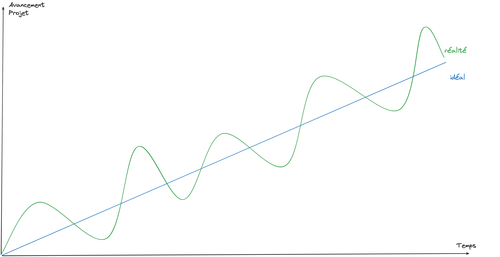
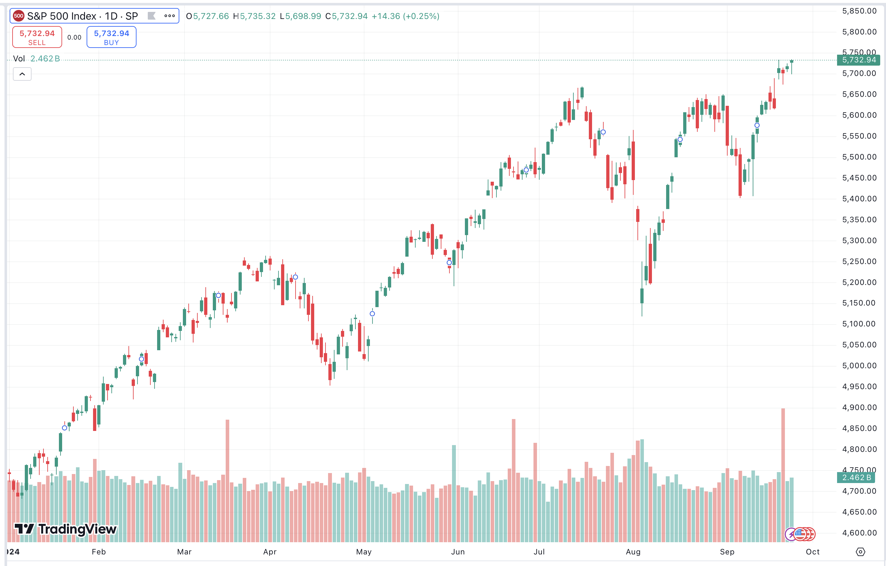
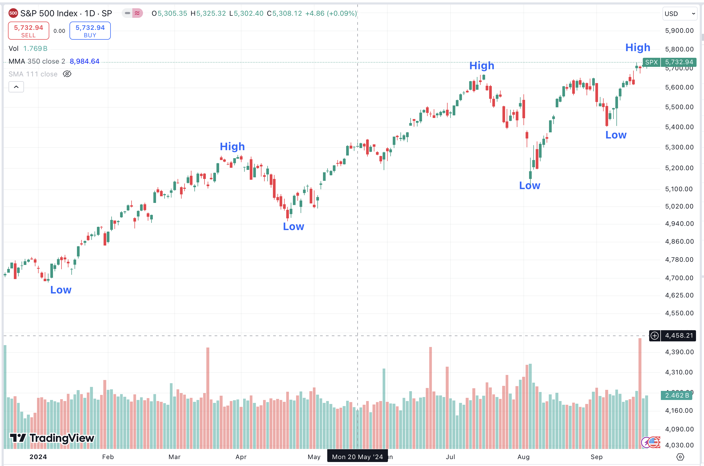
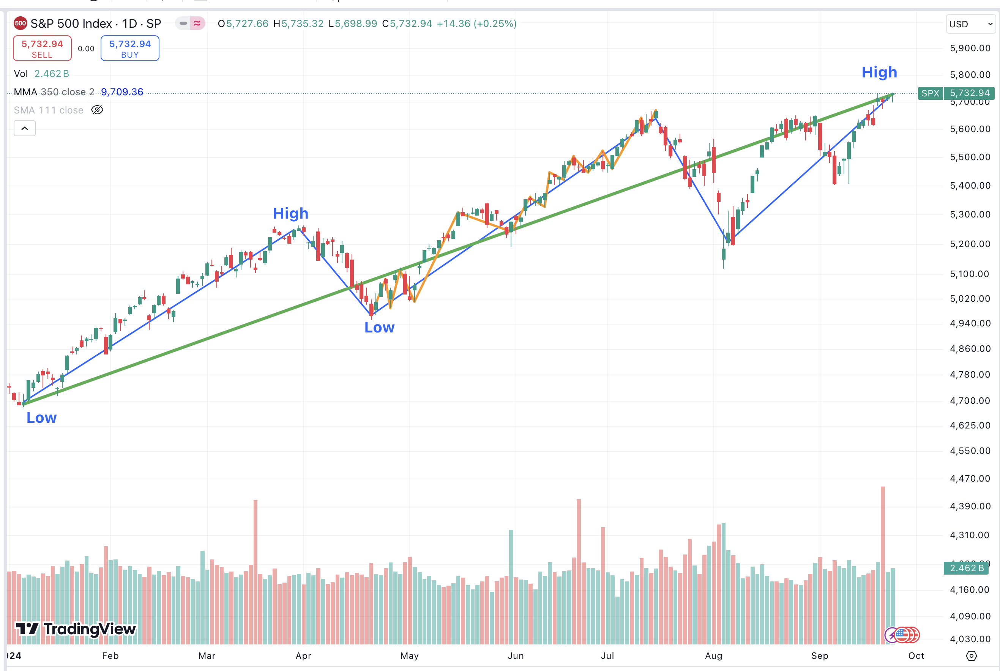

title: Un projet avance rarement en ligne droite
description: Mashup : gestion de projet vs. analyse technique des marchés financiers
date: 20241002
author: Simon
tags: article, mashup

---

_Mashup : J'aime bien créer des liens entre des idées ou des disciplines pour découvrir de nouvelles perspectives : transposer le modèle mental d'une discipline pour décortiquer un problème dans une autre discipline, utiliser ce que j'ai appris à gauche pour le réutiliser à droite... L'objectif de cette série "Mashup" est de partager ces tentatives de mélange entre différents concepts._

---

Ces derniers mois, il m'est régulièrement arrivé d'avoir des discussions avec mes collègues qui ressemblent à :

\- "C'est relou, on avance pas sur le projet, on est organisé avec les pieds et les boss foutent quoi sérieux ?"  
\- "Ouais, c'est vrai que ça va pas aussi vite et aussi bien qu'on le voudrait, mais en vrai, on avance quand même, si on regarde un peu dans le rétro entre où on était il y a quelques mois et maintenant, on a quand même pas mal bougé non ?"

Ce n'est pas évident de gérer sa propre frustration ou celle de ses collègues sur un projet qui semble stagner ou régresser, et pour essayer d'appuyer mon propos, je me suis retrouvé à gribouiller quelque chose qui ressemble à ça :

Ce genre de dessin m’a fait penser à une autre discipline que je trouve passionnante : l'analyse technique des marchés financiers.

## Qu'est-ce que l'analyse technique ?

Quand on s'intéresse aux marchés financiers (actions, obligations, devises...), on a deux grandes manières d'étudier un actif :

* **L'analyse fondamentale** : c'est l'analyse profonde de l'entreprise ou du pays : quel est son modèle économique ? Son marché ? Sa santé financière ? Qui sont ses dirigeants ? Que peut-on déduire des comptes de résultats ? On se pose toutes ces questions pour se faire une idée du potentiel actuel et futur de l'entreprise et en déduire un prix.
* **L'analyse technique** : on va poser sur un graphique le prix et les volumes d'échanges dans le temps... et c'est tout ! On part du principe que toutes les informations sont comprises dans le couple prix/volume. Uniquement en manipulant ces deux éléments, on est capable de calculer des probabilités sur des tendances : est-ce que le prix a plus de chance de monter ou de baisser ? Jusqu'où pourrait-il monter ? À l'inverse, si le prix baisse, où a-t-il le plus de chances de se stabiliser ?

Prenons l'exemple du graphique de l'indice "SP500". Le SP500 est un indice qui regroupe les 500 plus grosses capitalisations nord américaines, voici son graphe au 25/09/2024 :

Ce que représente ce graphique c'est : le sentiment moyen des acteurs économiques par rapport au marché américain : si le prix monte c'est que "les gens", "le marché" sont optimistes et pensent que l'économie américaine (et par extension l'économie mondiale) a des chances de bien se porter dans les prochains mois. A l'inverse, si le prix baisse, cela signifie que les investisseurs sont inquiets pour le futur et que finalement les entreprises américaines feront peut-être moins de profit que prévu. En gros ce simple graphique prix/temps permet d'avoir une vue sur la psychologie du marché.

L'analyse graphique existe depuis déjà un bon moment, et de nombreuses "règles" et "théories" ont émergé au fil du temps. Voici deux des théories que j'ai intégré dans mes modèles mentaux :

## 1 - Le marché évolue en tendance :

* Une tendance est dite "haussière" quand les plus hauts sont de plus en plus haut, et les plus bas de plus en plus hauts
* Une tendance est dite "baissière" quand les plus hauts sont de plus en plus bas et les plus bas de plus en plus bas
* Une tendance est considérée comme neutre ou "en range" quand le prix reste contenu entre deux valeurs à l'horizontal

Il est assez facile d'identifier si un marché est plutôt en tendance haussière, baissière ou neutre : il suffit de regarder les "hauts" et les "bas" d'un graphique. Si on reprend notre graphique de l'indice SP500, on peut assez facilement déterminer que depuis le début de l'année, la tendance est clairement haussière, même s' il y a eu plusieurs corrections au cours de l'année.

## 2 - Le marché a trois mouvements principaux qui s'imbriquent les uns dans les autres

| Mouvement  | Durée approximative           | Analogie      | Commentaire                                          |
| ---------- | ----------------------------- | ------------- | ---------------------------------------------------- |
| Principal  | Entre une et plusieurs années | La marée      | Mouvement de fond                                    |
| Secondaire | Entre 3 semaines et 3 mois    | La vague      | Va généralement à l'encontre du mouvement primaire   |
| Tertiaire  | Moins de 3 semaines           | La vaguelette | Va généralement à l'encontre du mouvement secondaire |

Si on reprend notre graphique plus haut, on peut facilement identifier ces différents mouvements avec :

* En vert, le mouvement principal qui est clairement haussier
* En bleu, plusieurs mouvements secondaires qui alternent hausses et baisses, ce sont les corrections qui font baisser le prix à plusieurs reprises
* En orange, des mouvements tertiaires qui sont moins facilement perceptibles entre les "high" et les "low" et qui font que le graphique n'évolue pas en ligne droite entre chaque bas et chaque haut mais plutôt "en zigzag"

## Quel lien je fais avec les projets sur lesquels je bosse ?

La première leçon que je retiens de ce parallèle avec l'analyse technique, c'est que comme les marchés financiers, mes projets évoluent selon différents mouvements qui s’imbriquent les uns dans les autres :

* Si je me retrouve dans une période où j'ai l'impression que l'on stagne ou que l'on régresse, la première chose que je vais faire c'est "dézoomer", regarder une unité de temps plus longue, aller chercher la tendance "principale" de mon projet.
* Si j'ai l'impression que ma journée est naze, je regarde ce qui s'est passé pendant ma semaine, si j'ai l'impression que nous n'avons rien fait de la semaine, je regarde où nous étions il y a 3 mois...
La question que je me pose systématiquement c'est : "est-ce que j'ai toujours les mêmes problèmes qu'il y a six mois ou un an ?" Si la réponse est "non", c'est probablement que je me trouve dans une phase de “correction”, que je regarde le mouvement secondaire ou tertiaire, ce que je perçois n'est que du bruit et le mouvement principal de mon projet reste haussier.

La seconde leçon que je retiens c'est que mes projets n'évoluent pas en ligne droite... et c'est normal !

* Tant que j'ai l'impression que les plus hauts sont de plus en plus haut et que les plus bas sont également de plus en plus haut, je sais que je vais dans le bon sens
* Comme les marchés financiers, nos projets vont avoir de gros pics d'avancement dans des périodes d'euphorie où rien ne peut nous arrêter puis probablement stagner un moment pour "reprendre leur souffle" car les acteurs du projet ne peuvent pas être à fond tout le temps, peut être même que nous allons régresser un peu dans certains cas car des facteurs externes qui n'étaient pas prévus vont venir contraindre le projet (budget, vacances, pilotage, ambiance dans l'entreprise...), mais au global... on avance.

Ce modèle mental m'est assez utile dans mes discussions avec mes collègues mais il reste pour l'instant assez vague, j'ai régulièrement en tête le tout premier graphique partagé dans cet article mais je trouve qu'il me manque encore quelque chose pour le rendre plus concret.

J'ai conservé l'unité "avancement projet" sur l'axe des ordonnées mais je n'en suis pas satisfait. J'aimerais pouvoir trouver une unité qui reflète plus le "sentiment des équipes", de la même manière que le prix représente le "sentiment du marché" mais pour l'instant je n'ai pas de meilleure idée !
